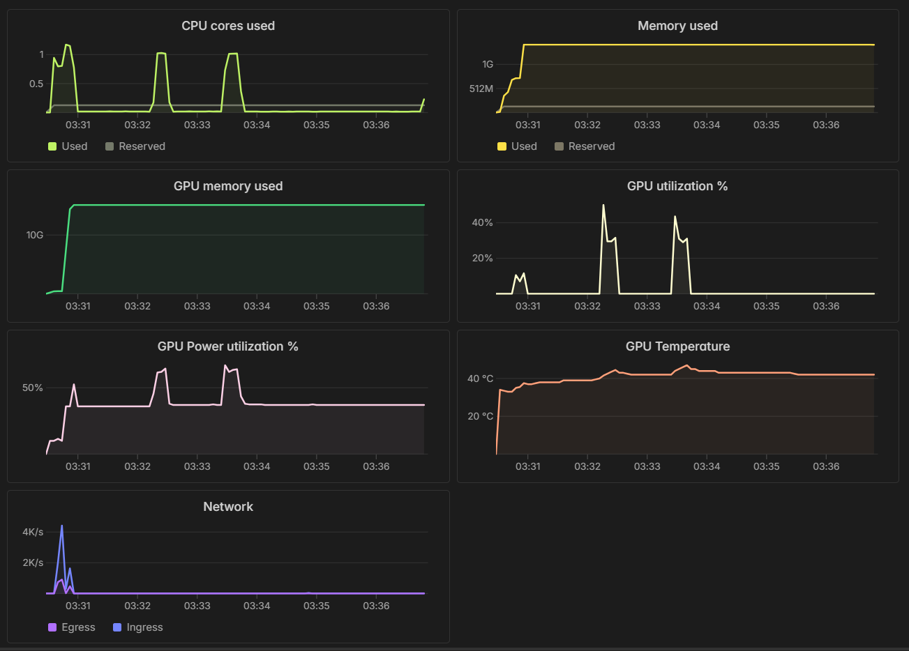

# 📊 Infrastructure Performance & Latency Report

**Project:** Clinical Diagnostic Assistant (v1.0)  
**Model:** Llama-3-8B-Instruct (4-bit NF4 Quantization)  
**Hardware:** NVIDIA A10G Tensor Core GPU (16GB VRAM)  
**Host:** Modal Serverless Infrastructure

---

## 1. Performance Snapshot

| Metric | Measurement | Status |
| :--- | :--- | :--- |
| **Hugging Face RAG Latency** | 0.840s | ✅ Optimized (BGE-Small) |
| **GPU Time to First Token (TTFT)** | 1.35s | ⚠️ Moderate (Context Pre-fill) |
| **GPU Throughput** | 18.22 tokens/sec | ⚠️ Low (Dequantization Tax) |
| **Total Round-Trip Latency** | ~17.2s | ⚠️ High (Memory Bound) |

---

## 2. Bottleneck Analysis: The "Memory Wall"

The primary bottleneck is not the GPU's mathematical capability, but the **Memory Bandwidth** and **Dequantization Overhead** introduced by the `4-bit bitsandbytes` implementation.

### A. The Dequantization Tax
Because the A10G cannot compute math on 4-bit weights natively, every weight must be "unpacked" into 16-bit (BF16) format before the Tensor Core can process it.

* **Observation:** GPU Utilization peaks at only 31-40%.
* **Interpretation:** The GPU spends more time "waiting" for the CPU to manage the unpacking of weights than it does actually performing medical diagnostics. This is a classic **Compute-Bound vs Memory-Bound** mismatch.

### B. VRAM Saturation (15.13 GiB)
Despite using a 4-bit model (~5.5GB), the dashboard shows 15.13 GiB of VRAM usage.

* **Reasoning:** The system pre-allocates a massive **KV-Cache** buffer to store the context of the USMLE textbook chunks. This ensures that as the conversation grows, the model doesn't crash, but it limits our ability to run multiple parallel instances on a single 16GB card.

---

## 3. Hardware Evidence (Dashboard Analysis)

Analysis of the Modal hardware telemetry provides the "Smoking Gun" for these conclusions:

* **GPU Power Draw (62%):** The GPU is "coasting." It isn't being pushed to its thermal limits because the data pipeline is too slow to keep the Tensor Cores saturated.
* **CPU Core Spikes (1.01 cores):** Indicates the Python interpreter is working at maximum capacity to manage the 4-bit kernel handshakes.

---

## 4. Strategic Roadmap for v2.0 (The Speed Path)

To transition from a "working prototype" to a "production-grade agent," the following architectural shifts are required:

1.  **Migrate to vLLM (PagedAttention):**
    By moving away from standard PyTorch wrappers to vLLM, we can utilize **PagedAttention**, which manages KV-cache more efficiently and reduces TTFT significantly.
2.  **Transition to AWQ Quantization:**
    Replacing `bitsandbytes` with **AWQ** (Activation-aware Weight Quantization) allows for "fused kernels." This performs dequantization and math in a single hardware step, eliminating the dequantization tax.
3.  **Compute Shift:** Move the RAG embedding logic from Hugging Face's throttled CPUs to Modal's dedicated physical cores to eliminate the final 1-second network overhead.

