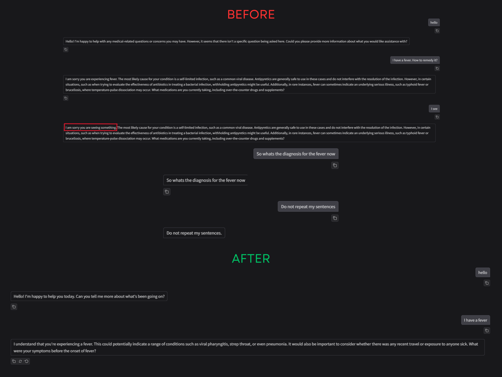
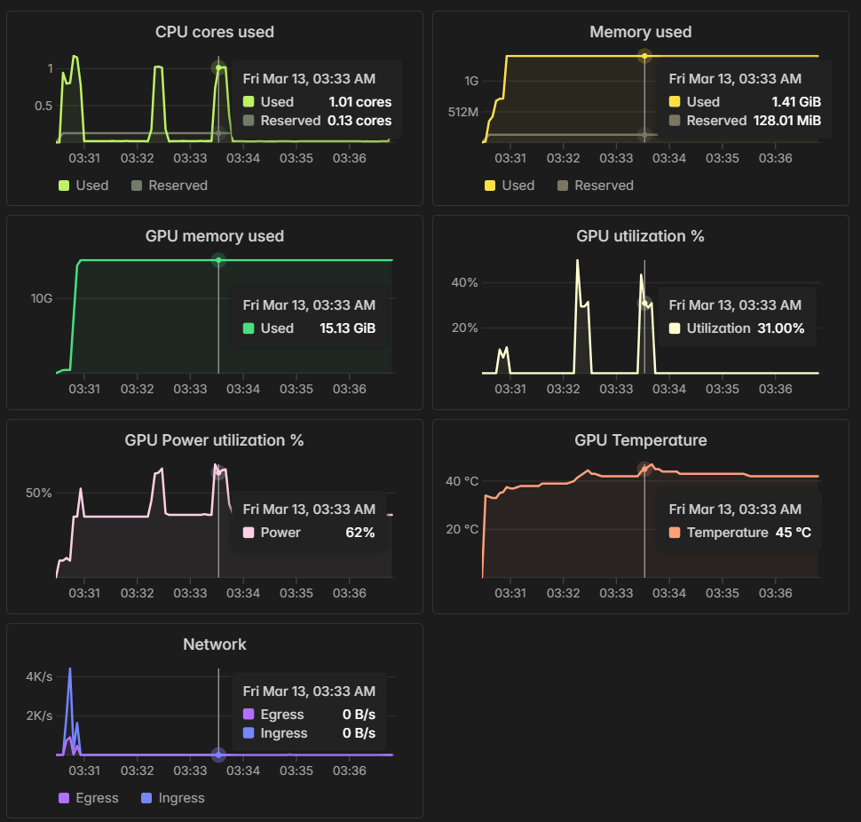
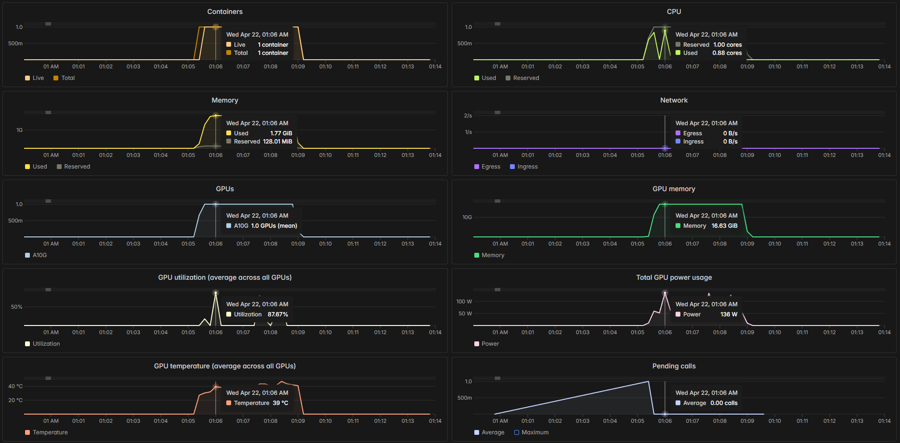

# Serverless Clinical AWQ Llama Engine (S.C.A.L.E.)

**Live Inference Interface:** [Hugging Face Space](https://huggingface.co/spaces/foobar41/llama3-8b_lora_medical_inference)

## 🏗️ Architecture Overview

**S.C.A.L.E.** is a stateless, multi-turn clinical inference microservice. It routes a hybrid sparse/dense vector retrieval pipeline through a **W4A16 AWQ-quantized Llama-3.1** backend, served via **vLLM** on ephemeral **Modal serverless GPUs**.

This project implements a bare-metal MLOps approach to manage VRAM constraints, network I/O latency, and state management in production deployments. The repository tracks the architectural migration from a local prototype (v0) to an AWS Docker container (v1), culminating in the final serverless vLLM pipeline (v2).

---

## ⚡ Key Performance Metrics

| Metric | Value |
| :--- | :--- |
| **Time-To-First-Token (TTFT)** | 0.529s |
| **End-to-End Latency** | Sub-2s |
| **Throughput** | ~60 tokens/sec |

---

## ⚙️ Core Stack

| Component | Technology |
| :--- | :--- |
| **Inference Engine** | vLLM (Continuous Batching, Automatic Prefix KV Caching) |
| **Compute Tier** | Modal (Serverless A10G GPU, Scale-to-Zero) |
| **Base Model** | Meta-Llama-3.1-8B-Instruct |
| **Fine-Tuning** | LoRA adapter merged & AWQ 4-bit quantized (14% gain in USMLE accuracy). |
| **Vector Database** | Pinecone (384-dimensional Hybrid Sparse/Dense) |
| **Embeddings** | BGE-Small (Dense) + BM25 (Sparse) + MiniLM (Cross-Encoder Reranking) |
| **Client/State Manager** | Hugging Face Spaces (`v2_hf_serverless/cpu_orchestrator/app.py`) |
---

## 🛠️ Infrastructure & Implementation Details

### 1. The Hardware Audit: AWQ vs. NF4
Early prototypes utilizing BitsAndBytes NF4 quantization resulted in severe compute bottlenecks, stalling the A10G GPU at ~35% utilization. The hardware was bottlenecked by the "dequantization tax"—spending more cycles unpacking weights than performing matrix multiplications. Migrating the pipeline to an AWQ (Activation-Aware Weight Quantization) format leveraged fused kernels, unlocking near 100% GPU utilization and driving throughput to 60 tokens/sec.

### 2. The Precision Trap: The FP16 NaN Wall
During deployment, the pipeline encountered severe numerical instability (NaN walls) when running in standard FP16. Llama-3.1's SwiGLU activation functions regularly produce activation spikes exceeding 65,504 (the FP16 upper bound). To prevent tensor overflow, deploying with a strict **BF16 (Bfloat16)** compute data type is a hard architectural requirement.

### 3. Stateless Multi-Turn Architecture
To support horizontal scaling across serverless GPU containers, the backend is strictly stateless. Conversational state is serialized client-side and injected into the HTTP POST payload on every request. The system relies on vLLM's KV cache to deduplicate prefix computation for warm containers, avoiding the compute overhead of full-context reprocessing.

### 4. I/O Latency and vLLM Compilation
Standard PyTorch compilation (`torch.compile`) over network-attached volumes (Modal NFS) introduced significant cold-start latency due to high-IOPS binary reads. This engine enforces raw eager execution (`enforce_eager=True` in vLLM), sacrificing peak throughput to bypass network I/O bottlenecks and optimize serverless cold-start times.

### 5. State Machine Routing (Instruct Alignment)
The pipeline leverages the RLHF alignment of the Llama-3.1-8B-Instruct architecture to execute a deterministic state machine via system prompting, handling four conversational states (Pure Question, Pure Symptoms, Mixed Compound, and Conversational Follow-up) to prevent diagnostic looping on conversational filler.
*Below: Resolving algorithmic literalism. The 'Before' state shows the pipeline failing to handle conversational filler ("I see") and entering an echo loop. The 'After' state demonstrates the hardened Instruct-aligned routing.*


### 4. Deterministic Query Expansion
To improve retrieval precision in Pinecone's 384D embedding space, symptom queries under 8 words are intercepted and programmatically expanded with specific medical taxonomy prior to vectorization and cross-encoder reranking.

---

## 📊 Performance & Telemetry

Profiling is critical when migrating from raw weights to 4-bit AWQ on serverless infrastructure. Detailed latency splits across the dense embedding, Pinecone network fetch, and CPU cross-encoder reranking phases are documented in the `LATENCY_REPORT.md`.

### GPU Memory Profiling (A10G)
Below are the VRAM allocation comparisons demonstrating the footprint reduction from BitsAndBytes to the final AWQ target.

#### BitsAndBytes


#### AWQ


---

## 🚀 Deployment & Usage

### 1. System Prerequisites
* **Cloud Deployment:** A Modal account with A10G access.
* **Local Development:** * Minimum VRAM: 16GiB

### 2. Environment Setup
The project uses `uv` for fast dependency resolution. Install the necessary serverless and development dependencies:

```bash
uv pip install -r requirements/dev_all.txt
uv pip install -r requirements/hf_serverless.txt
```

Ensure the following secrets are configured in your Modal environment and local `.env`:
```bash
PINECONE_API_KEY="your-pinecone-key"
MICROSERVICE_SECRET_KEY="your-custom-auth-key"
HF_TOKEN="your-huggingface-token"
```

### 2. Launching the Backend (Modal)
To serve the inference engine dynamically for development and testing:
```bash
modal serve v2_hf_serverless/gpu_inference/modal_engine.py
```
You can test the active endpoint directly by executing `python v2_hf_serverless/gpu_inference/test_endpoint.py.`

To deploy the production endpoint:

```bash
modal deploy v2_hf_serverless/gpu_inference/modal_engine.py
```

### 3. Pinecone Vector Ingestion
If you need to rebuild the USMLE index, run the ingestion pipeline:

```bash
python v2_hf_serverless/vector_ingestion/ingest_medical_rag.py
```
